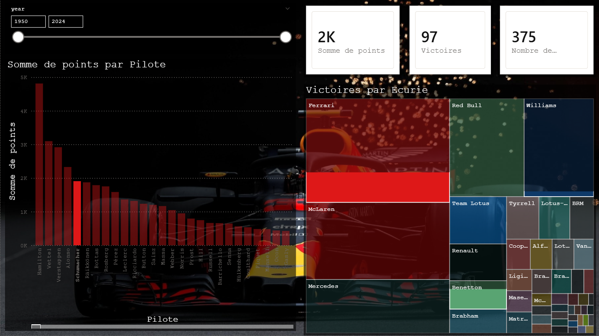

# F1 World Championship Dashboard

Dashboard Power BI sur les données F1 (1950-2024).

## Fonctionnalités
- Modèle en étoile avec 4 tables reliées (races, results, drivers, constructors)
- Mesure DAX custom pour le calcul des victoires
- Slicers interactifs par année
- KPIs : points totaux, victoires, courses disputées

## Données
Source : Kaggle - Formula 1 World Championship Dataset
